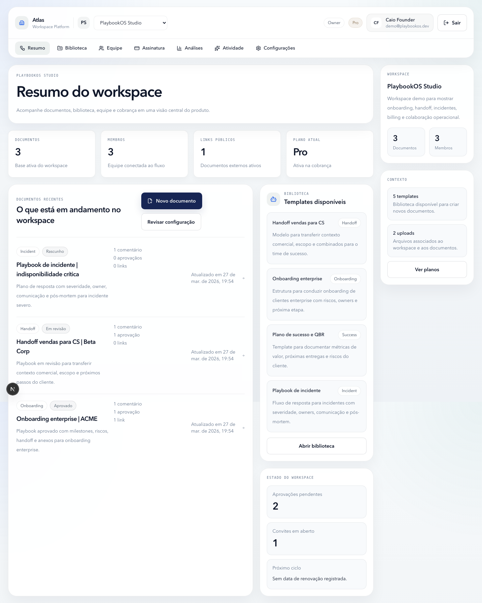

# Atlas Workspace

Plataforma SaaS para documentação operacional, colaboração em tempo real e governança de conteúdo em workspaces compartilhados. O produto concentra edição, biblioteca, membros, aprovações e cobrança em um único ambiente.

## Visão Geral

O projeto foi estruturado como um monorepo com interface web em Next.js e API em NestJS, apoiado por PostgreSQL, Prisma, Socket.IO e Stripe.

Na prática, a plataforma combina:

- editor de documentos com colaboração em tempo real
- biblioteca de documentos e templates
- gestão de workspaces e membros
- compartilhamento público por link
- análises operacionais e onboarding
- cobrança e planos integrados ao produto

## Principais Funcionalidades

- autenticação com e-mail e senha
- Google OAuth para acesso social
- editor colaborativo com blocos e sincronização em tempo real
- comentários, revisões e histórico de versões
- criação e reutilização de templates
- upload de arquivos e anexos
- compartilhamento público de documentos
- workspaces com membros, permissões e configurações
- painel de cobrança com integração Stripe
- camada opcional de recursos de IA no backend

## Capturas de Tela

### Dashboard



## Stack

### Frontend

- Next.js 16
- React 19
- Tailwind CSS 4
- TypeScript
- Socket.IO Client
- Lucide React

### Backend

- NestJS 11
- Prisma ORM
- PostgreSQL
- Socket.IO
- Stripe
- Passport JWT
- Google OAuth 2.0

## Arquitetura

```text
.
├── apps
│   ├── api
│   └── web
├── package.json
├── docker-compose.yml
└── README.md
```

Os módulos centrais da API incluem:

- `auth`: login, JWT e Google OAuth
- `documents`: editor, metadados e histórico
- `collaboration`: sincronização em tempo real
- `templates`: estruturas reutilizáveis
- `workspaces`: organização por conta e membros
- `public-shares`: compartilhamento externo
- `uploads`: anexos e arquivos
- `billing`: cobrança, planos e Stripe
- `ai`: camada de recursos assistidos por modelo

## Fluxos Principais

### Workspace

- cria ou acessa um workspace
- organiza documentos e templates
- convida membros
- acompanha atividade e análises

### Documentação

- cria documentos a partir do zero ou de templates
- edita em colaboração com sincronização em tempo real
- revisa, comenta e compartilha por link público

### Operação

- acompanha onboarding, membros e configurações
- gerencia cobrança e plano ativo
- usa os módulos do produto sem depender de várias ferramentas isoladas

## Execução Local

### Requisitos

- Node.js 20+
- npm
- Docker e Docker Compose

### 1. Instale as dependências

```bash
npm install
```

### 2. Suba o PostgreSQL

```bash
docker-compose up -d
```

Banco local:

- host: `localhost`
- porta: `5432`
- database: `notion_ai`
- user: `notion`
- password: `notion`

### 3. Configure as variáveis de ambiente

Copie os exemplos existentes:

```bash
cp apps/api/.env.example apps/api/.env
cp apps/web/.env.example apps/web/.env.local
```

Variáveis de integração como Google OAuth, Anthropic e Stripe podem permanecer vazias durante o setup inicial se esses fluxos não forem utilizados localmente.

### 4. Prepare o banco

```bash
npm run db:generate
npm run db:push
npm run db:seed
```

### 5. Inicie a aplicação

```bash
npm run dev
```

Ou rode separadamente:

```bash
npm run dev:web
npm run dev:api
```

Endereços locais:

- frontend: [http://localhost:3000](http://localhost:3000)
- API: [http://localhost:4000/api](http://localhost:4000/api)

## Scripts Úteis

```bash
npm run dev
npm run build
npm run lint
npm run db:generate
npm run db:push
npm run db:migrate
npm run db:seed
```

## Observações

- os arquivos `.env.example` de `apps/api` e `apps/web` já cobrem o setup base do projeto
- Google OAuth, Stripe e recursos de IA dependem de credenciais válidas para uso completo

## Roadmap Técnico

- adicionar testes automatizados para fluxos críticos
- documentar contratos principais da API
- ampliar a camada de analytics e auditoria
- refinar permissão por workspace e papéis
- fortalecer pipeline de CI para lint, build e validações

## Licença

Projeto disponibilizado para demonstração técnica.
